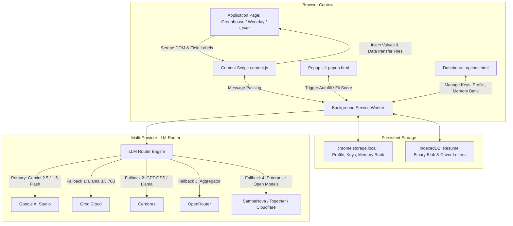

# Architectural Blueprint & Deployment Feasibility Analysis: "TrackMe" Chrome Extension

## 1. Executive Summary & Feasibility Verdict

| Question | Verdict | Details |
| :--- | :---: | :--- |
| **Is this extension possible to build?** | **YES (100%)** | All core capabilities (form scraping, multi-provider LLM routing, synthetic event dispatching, demographic state memory, cover letter matching) are implementable in pure Manifest V3. |
| **Is it possible to deploy to the Chrome Web Store?** | **YES (100%)** | Fully compliant with Google Chrome Web Store policies, Manifest V3 CSP restrictions, and Single Purpose guidelines, provided user data and API keys remain strictly local. |
| **Can it automatically upload the resume file?** | **YES with caveat** | Browser security prevents reading arbitrary OS paths like `C:\Users\...` or `/home/...` without user interaction. **Solution:** User uploads the resume once into the extension dashboard; the extension persists the binary `Blob` in `IndexedDB` and programmatically attaches it using `DataTransfer` API to any `<input type="file">`. |

---

## 2. Browser Security Realities & Engineering Workarounds

### 2.1 File Path Automation vs. Web Sandbox Security
* **The Constraint:** In modern Chrome (and all Chromium browsers), web page JavaScript and extension content scripts are blocked by the OS sandbox from reading local disk paths (`fs.readFile`) or arbitrarily setting `fileInput.value = "/path/to/file.pdf"`. Browsers intentionally replace the value with `C:\fakepath\resume.pdf` to protect user privacy.
* **The Solution (Zero-Dependency & Store-Compliant):**
  1. The user selects or drags their resume PDF/DOCX once during onboarding or in the extension settings.
  2. The extension reads the raw binary buffer and stores it as an `ArrayBuffer` / `Blob` inside `IndexedDB` (backed by `unlimitedStorage`).
  3. When an application page loads with `<input type="file">` labeled "Resume", "CV", or "Attach Resume":
     ```javascript
     const file = new File([storedBlob], storedFileName, { type: 'application/pdf' });
     const dataTransfer = new DataTransfer();
     dataTransfer.items.add(file);
     fileInput.files = dataTransfer.files;
     fileInput.dispatchEvent(new Event('input', { bubbles: true }));
     fileInput.dispatchEvent(new Event('change', { bubbles: true }));
     ```
  4. This programmatically attaches the resume file to the form identically to a real user drag-and-drop event.

### 2.2 Modern Frameworks & React Synthetic Event Traps
* **The Constraint:** Modern Applicant Tracking Systems (Workday, Greenhouse, Lever, Ashby, BambooHR) use React, Vue, or Angular. If an extension simply sets `input.value = "John"`, React's virtual DOM state is unaware of the mutation. When the user hits Submit, the fields reset to blank.
* **The Solution:** The extension uses prototype setter hijacking + synthetic event dispatching:
  ```javascript
  const prototype = Object.getPrototypeOf(inputElement);
  const descriptor = Object.getOwnPropertyDescriptor(prototype, 'value');
  descriptor.set.call(inputElement, value);
  inputElement.dispatchEvent(new Event('input', { bubbles: true }));
  inputElement.dispatchEvent(new Event('change', { bubbles: true }));
  inputElement.dispatchEvent(new Event('blur', { bubbles: true }));
  ```

### 2.3 Cross-Origin Requests & CSP Bypass
* **The Constraint:** Content scripts executed inside job application web pages are restricted by the host website's Content Security Policy (`connect-src`). If a site blocks external domains, direct calls to `https://generativelanguage.googleapis.com` or `https://api.groq.com` from the page will fail.
* **The Solution:** Content scripts NEVER call LLM APIs directly. Instead, they send a message to the Manifest V3 **Background Service Worker** (`chrome.runtime.sendMessage`), which executes the cross-origin `fetch` using extension `host_permissions`. Extension service workers are immune to page CSP.

---

## 3. System Architecture & Component Diagram



---

## 4. Multi-Provider Router Matrix

The router features an **automatic cascade fallback** mechanism. If the primary provider hits a 429 rate limit or 503 outage, it seamlessly switches to the next configured provider without interrupting the autofill session.

| Provider | Model / Endpoint | Free Tier Capability | Role in Router |
| :--- | :--- | :--- | :--- |
| **Google AI Studio** | `gemini-2.5-flash` / `gemini-1.5-flash` | Very high daily quota, native multimodal PDF parsing | **Primary Engine** (Profile parser + complex reasoning) |
| **Groq** | `llama-3.3-70b-versatile` | ~1,000 req/day, ultra-low latency (<300ms) | **Fast-Path Engine** (Form field classification & filling) |
| **Cerebras** | `llama3.1-70b` | High throughput, token-dense context | **High-Volume Fallback** |
| **OpenRouter** | `meta-llama/llama-3.3-70b-instruct:free` | 50 req/day free router | **Universal Fallback Router** |
| **SambaNova** | `Meta-Llama-3.1-70B-Instruct` | Free developer tier | **Backup Engine** |
| **Together AI** | `meta-llama/Meta-Llama-3.1-70B-Instruct-Turbo` | Free credits on signup | **Auxiliary Engine** |
| **Cloudflare Workers AI** | `@cf/meta/llama-3.1-8b-instruct` | 10k daily neurons on free tier | **Serverless Edge Fallback** |

---

## 5. End-to-End Workflow

### Step 1: Onboarding & API Key Provisioning
* Extension prompts the user to enter at least one API key (Gemini, Groq, Cerebras, etc.).
* Keys are tested instantly via a health check ping and saved locally in `chrome.storage.local`.

### Step 2: Resume Ingestion & "One Final Run" Verification
1. User drops their Resume (PDF or TXT).
2. The file is parsed either locally or passed to Gemini multimodal Flash.
3. The LLM extracts a structured JSON schema:
   * **Contact & Basic:** Full Name, First/Last Name, Email, Phone, LinkedIn, GitHub, Location, Roll No / Student ID.
   * **Academic & Work:** Education entries, Work experiences, Skills, Projects.
   * **Demographics & Compliance:** Work Authorization, Visa sponsorship requirements, Disability status, Veteran status, Gender, Pronouns, Race/Ethnicity, Salary expectations.
4. **The Final Run Screen:** The user is presented with a complete editable verification table where they can review every parsed field, correct any nuances, and press **"Confirm & Lock Profile"**.
5. The raw file blob is safely indexed in `IndexedDB` for future programmatic attachment.

### Step 3: Page Scraping & Intelligent Form Filling
1. When visiting any job application page, a lightweight, non-intrusive floating pill appears: `TrackMe: Auto-Fill Form`.
2. The scanner extracts all interactive fields: `<input>`, `<select>`, `<textarea>`, ARIA comboboxes, and custom dropdowns.
3. It gathers label context, placeholder, aria-label, surrounding question text, and select option lists.
4. Fast regex matches standard fields (Name, Email, Phone, Links) for instantaneous filling.
5. Complex/Demographic/Custom questions (e.g. "Do you now or in the future require sponsorship?", "Describe your biggest technical challenge") are passed to the LLM along with the user's verified profile and memory bank.
6. The extension populates all inputs, simulates events, and automatically attaches the resume file to file inputs.

### Step 4: Cover Letter Ingestion & Role-Fit Internal Audit
* When a cover letter is uploaded or when an application asks for one:
  1. The extension stores the cover letter content in the user's library.
  2. The page analyzer extracts the **Job Title**, **Company Name**, and **Job Description / Requirements** from the active tab.
  3. The LLM conducts an **Internal Fit Audit**:
     * **Match Score:** 0–100%
     * **Matched Strengths:** Direct overlap between candidate qualifications and job posting.
     * **Identified Gaps:** Critical keywords or required experiences absent in the cover letter.
     * **Actionable Recommendations:** Suggestions to tailor the cover letter before hitting submit.

### Step 5: Adaptive Memory Bank ("Continuous Learning")
* If the user manually edits or provides an answer to a new question on any application page, the extension can record that question-answer pair into the **Memory Bank**.
* Next time any company asks a variation of that question, TrackMe pulls the verified answer from memory!

### Step 6: Interactive In-Place Answer Regeneration (`dblclick` Refactoring)
* When a candidate double-clicks on any form question (input or textarea):
  1. The content script captures the double-click target and its full context (label, question prompt, current answer, target company, target role).
  2. Increments an in-memory variation counter for that specific input field.
  3. Displays an animated pulsing glow and an inline floating mini-badge (`✨ Refactoring with AI (Variation #N)...`).
  4. Calls the background LLM router with a rotational angle prompt (e.g. Variation 1: hands-on technical impact; Variation 2: company culture & mission alignment; Variation 3: concise punchy delivery; Variation 4: problem-solving & architecture decisions).
  5. Injects the newly generated response using prototype setter hijacking and dispatches React synthetic events.
  6. Subsequent double-clicks continuously cycle through new tailored variations!


---

## 6. Chrome Web Store Deployment Compliance Checklist

| Policy Requirement | TrackMe Implementation | Compliant? |
| :--- | :--- | :---: |
| **Manifest V3 Only** | Built purely on Manifest V3 with Service Workers. | ✅ Yes |
| **No Remote Executable Code** | All scripts, libraries, and parsers are packaged inside the extension. No remote eval. | ✅ Yes |
| **Single Purpose Policy** | Solely designed for automated form assistance & job application profile management. | ✅ Yes |
| **User Privacy & Permissions** | Zero third-party telemetry. User API keys and personal data stay strictly on the local machine. | ✅ Yes |
| **Minimal Permissions** | Requests only `storage`, `unlimitedStorage`, `activeTab`, and necessary LLM host permissions. | ✅ Yes |
